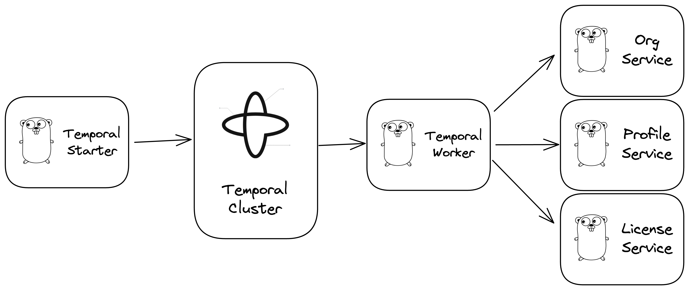

# temporal-saga-grpc

[](https://github.com/kevinmichaelchen/temporal-saga-grpc)

<p align="center">
<a href="https://raw.githubusercontent.com/kevinmichaelchen/temporal-saga-grpc/main/docs/design.png">

</a>
</p>

This project demonstrates using
<a target="_blank" href="https://temporal.io/">Temporal</a> to orchestrate a
<a target="_blank" href="https://microservices.io/patterns/data/saga.html">saga</a>
(effectively a distributed transaction) that interacts with multiple services
and has a robust, edge-case-proof rollback strategy, as well as durable function
execution.

**Temporal abstracts away failures.**

The upstream microservices that are called during the workflow all use gRPC.

## Resources:

- <a target="_blank" href="https://github.com/temporalio/samples-go/blob/main/saga/workflow.go">temporalio/samples-go</a>
- <a target="_blank" href="https://github.com/temporalio/money-transfer-project-template-go/blob/main/workflow.go">money-transfer-project-template-go</a>
- <a target="_blank" href="https://www.swyx.io/why-temporal/">swyx — Why
  Temporal?</a>
- <a target="_blank" href="https://youtu.be/-KWutSkFda8">YouTube — Intro to
  Temporal with Go SDK</a>

## Getting started

### Step 1: Spin everything up

We use [pkgx][pkgx] to run Temporal's dev server. We use Docker to run 
[Jaeger][jaeger] (a telemetry backend).

[pkgx]: https://pkgx.sh/
[jaeger]: https://www.jaegertracing.io

You can spin everything up with:

```shell
make all
```

### Step 2: Start a Temporal Workflow

```shell
curl -v http://localhost:8081/temporal.v1beta1.TemporalService/CreateOnboardingWorkflow \
  -H "Content-Type: application/json" \
  -d '{"license": {"name": "L1"}, "org": {"name": "Org1"}, "profile": {"name": "Kevin Chen"}}'

http POST \
  http://localhost:8081/temporal.v1beta1.TemporalService/CreateOnboardingWorkflow \
    license:='{"name": "L1"}' \
    org:='{"name": "Org1"}' \
    profile:='{"name": "Kevin Chen"}'
```

### Step 3: Check the UIs

- See traces in Jaeger at [localhost:16686](http://localhost:16686).
- See the Temporal Workflow at [localhost:8233](http://localhost:8233).
