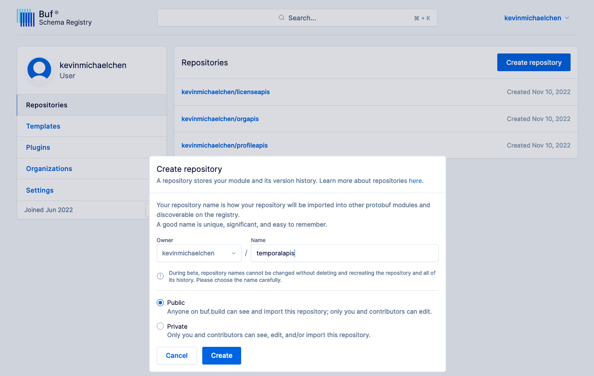

## Push to Buf Schema Registry (BSR)
Follow the [instructions](https://docs.buf.build/tour/log-into-the-bsr) to:
1. create a Buf account
2. create a Buf token
3. create a `~/.netrc` file with `buf registry login`
4. and create repositories for all your Buf modules [here](https://buf.build/kevinmichaelchen/repositories)

<p align="center">

</p>

When you're ready to push, run:
```shell
make buf-push
```

We now have code in the BSR for all our modules:
* [licenseapis](https://buf.build/kevinmichaelchen/licenseapis/docs/main:license.v1beta1)
* [orgapis](https://buf.build/kevinmichaelchen/orgapis/docs/main:org.v1beta1)
* [profileapis](https://buf.build/kevinmichaelchen/profileapis/docs/main:profile.v1beta1)
* [temporalapis](https://buf.build/kevinmichaelchen/temporalapis/docs/main:temporal.v1beta1)