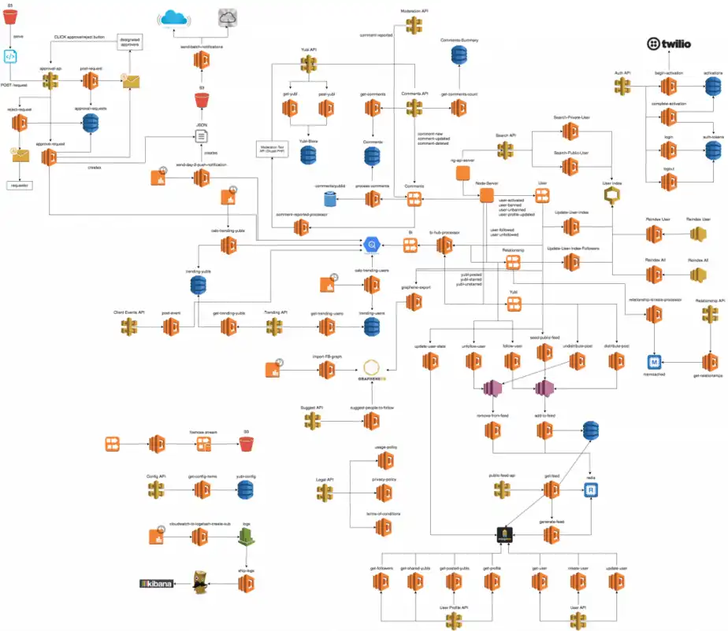

## Quick references

Before you dive in…

import { Card, CardGrid, LinkCard } from '@astrojs/starlight/components';

<Card title="Check these resources out">Hear from Temporal folks directly.</Card>

<CardGrid>
  <LinkCard title="Quick Intro" description="Series B Slides" href="https://docs.google.com/presentation/d/12pntYnP-22aKtF4ga4tFnpk1UDdM_5BiBwdPtaWIZGc/edit#slide=id.p1" target="_blank" />
  <LinkCard title="Why Temporal?" description="Blog Post from Swyx" href="https://www.swyx.io/why-temporal" target="_blank" />
  <LinkCard title="Temporal in 2 Minutes" description="Short YouTube video" href="https://www.youtube.com/watch?v=f-18XztyN6c" target="_blank" />
  <LinkCard title="Temporal in 7 Minutes" description="Short YouTube video" href="https://www.youtube.com/watch?v=2HjnQlnA5eY" target="_blank" />
  <LinkCard title="Intro to Temporal with Go SDK" description="35 minute YouTube video" href="https://www.youtube.com/watch?v=-KWutSkFda8" target="_blank" />
  <LinkCard title="samples-go" description="Code reference of a workflow from the samples-go repo" href="https://github.com/temporalio/samples-go/blob/main/saga/workflow.go" target="_blank" />
  <LinkCard title="money-transfer" description="Code reference of a workflow from the money-transfer example" href="https://github.com/temporalio/money-transfer-project-template-go/blob/main/workflow.go" target="_blank" />
</CardGrid>

## Past Experience

Distributed systems have never been easier (and, paradoxically, maybe harder) to build. In past roles, I saw systems built to varying degrees of success. I've seen engineers not concern themselves with data consistency issues, dismissing them as “edge cases”.

## Personal Story

“Let's just wrap this function in a Goroutine. It's a distributed system. Boom. Done.” By 2019, in my professional career of only a few years, I had encountered this line of thinking more than once.

Go offers such convenient and powerful concurrency primitives, that you can’t really blame folks for thinking this way. This is definitely the feeling you get from reading this [`errgroup` article][errgroup-article], or from watching Sameer’s [coffee-shop talk][coffee-shop-talk], where he shows how to model a real-world concurrent system in Go.

[errgroup-article]: https://www.fullstory.com/blog/why-errgroup-withcontext-in-golang-server-handlers/
[coffee-shop-talk]: https://www.youtube.com/watch?v=_YK0viplIl4

So I had seen folks implement these kinds of “inter-process communication” scenarios in one of two ways:

import { Tabs, TabItem } from '@astrojs/starlight/components';

<Tabs>
  <TabItem label="Commit then Send">
  ```go
  package main

  func myRequestHandler() {
	txn := db.StartTransaction()
	// perform some DB updates

	txn.Commit()
	sendEvent()
  }
  ```
  </TabItem>
  <TabItem label="Send then Commit">
  ```go
  package main

  func myRequestHandler() {
	txn := db.StartTransaction()
	// perform some DB updates

	sendEvent()
	txn.Commit()
  }
  ```
  </TabItem>
</Tabs>

The [Transactional Outbox][outbox] pattern solves the edge cases. It may feel like “over-engineering” to some, but in reality it's a good engineering practice.

[outbox]: https://microservices.io/patterns/data/transactional-outbox.html

By 2021, I had heard of [“Sagas”][sagas], but had never used them in my professional career. Instead, what I had seen time and time again, was microservices [_choreography_][choreography] with message brokers like [Kafka][kafka].

[sagas]: https://microservices.io/patterns/data/saga.html
[kafka]: https://kafka.apache.org/
[choreography]: https://temporal.io/blog/to-choreograph-or-orchestrate-your-saga-that-is-the-question

Conceptually, choreography is sound. It’s even decentralized, which is all the hype considering the ascendence of [Web3][web3]. In practice, however, it’s quite expensive in terms of development and infrastructure.

[web3]: https://en.wikipedia.org/wiki/Web3

The images from Swyx's blog are real problems faced by large enterprises, which are so big and flushed with so much cash that it's more convenient to have bad design proliferate than it is to make a good one.



And if proliferation and duplication of DevOps-type work isn’t the problem on such a giant scale, then it might be on a smaller scale. Even small shops use some combination of glued-together databases, queues, and schedulers.

## Enter Temporal

There needs to be some libary/mechanism/platform/etc for [orchestrating][orchestrating] [“long-lived”][long-lived] workflows. Whether that's Temporal or something else is irrelevant. Having a code-native developer experience for solving these challenges has compounding advantages in the long run, which is why [so many companies][big-names] have adopted Temporal.

[long-lived]: https://temporal.io/blog/long-running
[orchestrating]: https://temporal.io/blog/sergey-inversion-of-execution
[big-names]: https://temporal.io/use-cases

- [Snapchat](https://eng.snap.com/build_a_reliable_system_in_a_microservices_world_at_snap/)
- [Netflix](https://www.youtube.com/watch?v=LliBP7YMGyA)
- [Doordash](https://doordash.engineering/2020/08/14/workflows-cadence-event-driven-processing/)
- [Stripe](https://www.youtube.com/watch?v=Crkcr1S-NSc)
- [Coinbase](https://temporal.io/case-studies/reliable-crypto-transactions-at-coinbase)
- [Datadog](https://www.youtube.com/watch?v=Hz7ZZzafBoE)
- [Hashicorp](https://www.youtube.com/watch?v=kDlrM6sgk2k&t=1188s)
- [Airbyte](https://temporal.io/case-studies/airbyte-case-study)
- [Box](https://temporal.io/case-studies/temporal-a-central-brain-for-box)
- [Checkr](https://temporal.io/case-studies/how-temporal-simplified-checkr-workflows/)
- [Descript](https://temporal.io/case-studies/descript-case-study)
- [Zebra Medical Vision](https://temporal.io/case-studies/zebra-medical-case-study/)
